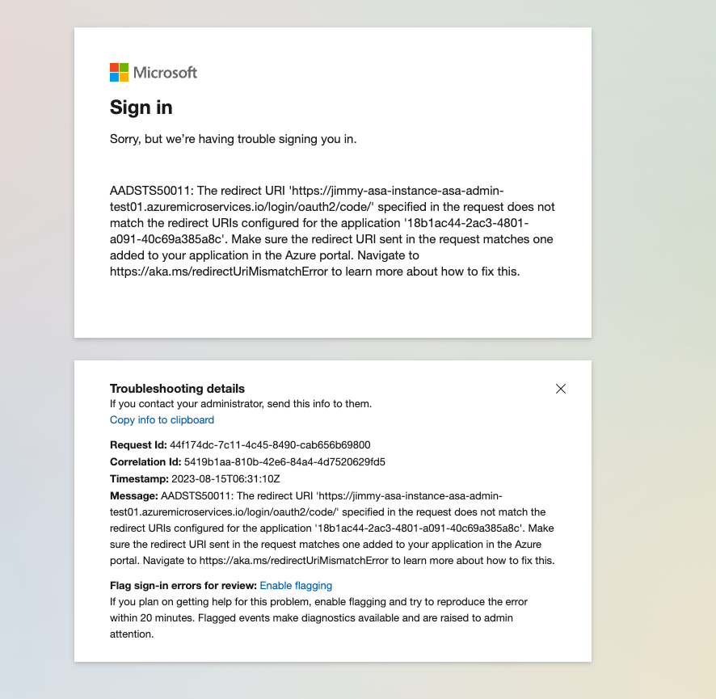
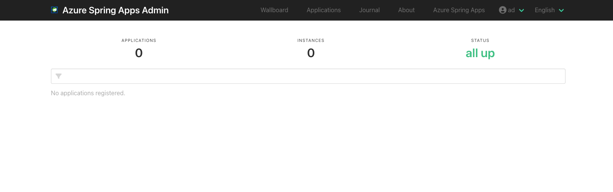

# Introduction - Azure Spring Apps Admin

Spring Boot Admin Server is an application for managing and monitoring microservice applications.

This repository maintains a customized Spring Boot Admin Server - **Azure Spring Apps Admin**, which did some enhancements beyond community Spring Boot Admin.

# What's the benefit of Azure Spring Apps Admin

1. Integrated with Microsoft Entra ID (Original name: Azure AD) to secure your dashboard
2. Easily deploy with one click Azure Spring Apps button instead of multiple Azure commands
3. Fully compatible with community Spring Boot Admin

# Run Azure Spring Apps Admin on Azure Spring Apps

To deploy Spring Boot Admin to Azure Spring Apps using the Azure Spring Apps button, you need below prerequisites:

- An Azure subscription
- A Microsoft Entra ID administrative roles user
- Azure Service Principal client id to enable Microsoft Entra ID - Adding AAD_CLIENT_ID environment variable
- Azure Service Principal client secret to enable Microsoft Entra ID - Adding AAD_CLIENT_SECRET environment variable
- Azure Service Principal tenant id to enable Microsoft Entra ID - Adding AAD_TENANT_ID environment variable
- An application URL exposed by Azure Spring Apps to integrate authentication with Microsoft Entra ID - Adding FULLY_QUALIFIED_DOMAIN_NAME environment variable

Then, you can run this Azure Spring Apps Admin by one click button:

After finish deployment, you will redirect the application endpoint, then to do oauth2 login.

If you meet below error, please refer [Add a redirect URI](https://learn.microsoft.com/en-us/azure/active-directory/develop/quickstart-register-app#add-a-redirect-uri) to add a redirect url:

After everything deploy successful, managing and monitoring your apps via Azure Spring Apps Admin.

